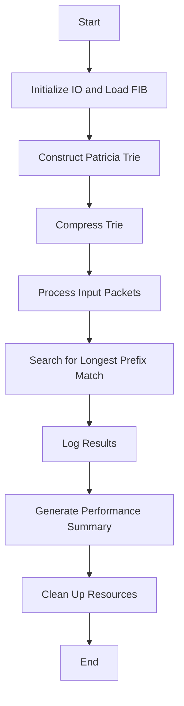

# **Optimized IP Route Lookup Using Compressed Binary Tries**

[](https://en.wikipedia.org/wiki/C99)  
[](https://en.wikipedia.org/wiki/C_standard_library)  
[](#)

## **📖 Overview**

The project introduces an efficient solution for IP route lookup by leveraging compressed binary tries (Patricia Trie). It aims to optimize the handling of large routing tables, ensuring fast lookup times and minimal memory consumption. The implementation simulates routing behavior by processing input packets, providing detailed performance metrics such as node accesses and lookup times. This makes it a valuable tool for high-performance networking systems and academic research. The optimization of the Forwarding Information Base (FIB) enhances lookup speeds while minimizing memory usage, addressing critical needs in modern networking infrastructures.

## **📋 Table of Contents**
- 🚀 [Introduction](#-introduction)
   - 💡 [Key Features](#-key-features)
- 🛠  [Implementation Details](#-implementation-details)
   - 🧩 [Components and Functionality](#-components-and-functionality)
   - 📁 [Files & Descriptions](#-files--descriptions)
   - 🔄 [Program Flow](#-program-flow)
   - 📊 [Visual Summary of Program Flow](#-visual-summary-of-program-flow)
- 📌 [How to Use](#-how-to-use)

---

## 🚀 **Introduction** 

Efficient IP route lookup is critical for modern networking devices like routers and switches. This program uses a compressed binary trie to optimize the lookup process. By reducing redundancy and optimizing memory usage, the algorithm achieves a balance between speed and resource consumption.

### 💡 Key Features
- **Optimized Binary Trie**: Implements a compressed Patricia Trie for efficient route searches by reducing redundant nodes.
- **Fast & Scalable**: Optimized for large routing tables with low memory and computational overhead, performing efficient IP-to-interface mapping.
- **Metrics Tracking**: Provides detailed statistics on search performance by measuring the time complexity and node accesses for each search.
- **Flexible Input/Output**: Handles customizable routing table files and IP packet lists.
- **Cross-Platform Compatibility**: Designed for Unix/Linux environments with GCC support.

---

## 🛠 **Implementation Details**

### 🧩 Components and Functionality

#### Input and Output (IO)
The program uses the `io.c` module for managing input and output files:
- **Input Files**: Includes the routing table (`FIB`) with network prefixes and output interfaces, and a file of input IP addresses.
- **Output File**: Records results such as the discovered output interface, processing time, and nodes accessed.
- **Functions**:
  - `initializeIO`: Initializes file handling for routing tables and input packets.
  - `readFIBLine`: Reads and parses a single routing table entry.
  - `readInputPacketFileLine`: Processes a single input IP address.
  - `printOutputLine` and `printSummary`: Output results and summarize performance metrics.

#### Binary Tree Structure
The Patricia trie is implemented with a `Node` structure:
- **Node Attributes**:
  - `prefix`: Network prefix as an integer.
  - `prefix_bin`: Binary representation of the prefix.
  - `prefixLength`: Length of the prefix.
  - `outInterface`: Associated output interface.
  - Pointers to left and right children.
  - Flags (`bitID`, `isOut`) for efficient traversal and compression.
  
- **Tree Construction**:
  - `insertNode`: Inserts routing entries by parsing the prefix bit-by-bit.
  - `compressTree`: Optimizes the trie by merging redundant nodes.

#### Route Lookup
The core of the project is the route lookup functionality:
- **Search Functionality**:
  - `searchInterface`: Finds the output interface for an input IP address by traversing the trie.
  - Tracks metrics such as node accesses and traversal time.

#### Packet Processing
The `main` function handles processing:
1. Reads IP addresses from the input file.
2. Uses `searchInterface` to find the matching output interface.
3. Logs metrics (e.g., processing time, node accesses) in the output file.

#### Performance Metrics
The program includes tools to evaluate its efficiency:
- Average nodes accessed and processing time per packet.
- Memory and CPU usage statistics using `getrusage`.

---
### 📁 Files & Descriptions

| **Filename**          | **Description**                                                                                                                                                                       |
|------------------------|---------------------------------------------------------------------------------------------------------------------------------------------------------------------------------------|
| **io.c**              | File responsible for input/output operations, including reading from files and displaying results to the console.                                                                    |
| **Makefile**          | Build automation file that compiles and links the project. Includes rules for building, cleaning, and managing dependencies.                                                          |
| **my_route_lookup.c**   | Executable binary resulting from the compilation process. It performs IP address lookups in the routing table and outputs the corresponding route information.                         |
| **utils.c**           | Contains utility functions such as `getNetmask` to compute netmasks and a simple hash function for indexing in a hash table.                                                          |
| **prueba1.txt, prueba2.txt, prueba3.txt**       | Input text files with a list of IP addresses for testing purposes, useful for validating the routing logic or hash table performance.                                                        |
| **routing_table.txt** | Routing table file (`FIB`) that maps network prefixes to their respective next-hop information, used for simulating and validating routing operations.                                         |

---

### 🔄 Program Flow

#### Initialization
1. **File Setup**: Opens the routing table (`FIB`) and input packet file.
2. **Tree Construction**:
   - Reads routing table entries and constructs the Patricia trie using `insertNode`.
   - Compresses the trie to remove redundant nodes with `compressTree`.

#### Packet Processing
1. For each IP address in the input file:
   - Traverses the trie using `searchInterface` to find the most specific matching prefix.
   - Measures processing time using `clock_gettime`.
   - Logs results (output interface, nodes accessed, processing time).

#### Finalization
1. Outputs a summary with:
   - Average nodes accessed.
   - Average processing time per packet.
2. Frees allocated memory (`freeTree`) and closes files (`freeIO`).

---

### 📊 Visual Summary of Program Flow


---

## 📌 **How to Use**
### Prerequisites
Before running the project, ensure the following requirements are met:
- **Operating System**: Unix/Linux
- **Compiler**: GCC or an equivalent C compiler
- **Input Files**:
  - `routes.txt`: Contains the routing table with prefixes and associated interfaces.
  - `input.txt`: Contains a list of input IP addresses to process.

---

### Steps to Execute

#### 1. Clone the Repository
Download the project to your local machine:
```bash
git clone https://github.com/your-username/Optimized-IP-Route-Lookup-Using-Compressed-Binary-Tries.git
cd Optimized-IP-Route-Lookup-Using-Compressed-Binary-Tries
```

#### 2. Build the Project
Compile the source code to generate the executable:
```bash
make
```

#### 3. Run the Program
Execute the program with the required input files:
```bash
./my_route_lookup routing_table.txt prueba1.txt
```
**This will create an output file (input.txt.out) containing the results.**
- You could use any of the FIB (routing_table.txt or a simplified version)
- You could use any of the Input File (prueba1.txt, prueba2.txt or prueba3.txt)
- Also you could create your FIB or Input File following the same format

#### 4. View Results
The output file (e.g., `input.txt.out`) contains lines structured in the following format:
```bash
<IP Address>;<Metric 1>;<Metric 2>;<Metric 3>
```

Each field represents specific details related to the route lookup process which allow users to evaluate the performance of the route lookup and the quality of routing decisions:

- **IP Address**: Represents the input IP address being processed (e.g., `24.16.0.155`). This is the address for which the program performs a route lookup.

- **Metric 1**: Indicates the total number of nodes accessed during the route lookup. This provides insight into the efficiency of the Patricia Trie traversal.

- **Metric 2**: Represents the depth of the Patricia Trie traversal for the specific IP address. A higher number typically corresponds to a more specific match in the routing table.

- **Metric 3**: Denotes the output interface or route identifier for the IP address. This is the final routing decision made by the program, such as the interface through which the packet should be forwarded.

**Example for the line 24.16.0.155;89;11;190**
```bash
- `24.16.0.155`: The IP address being processed.
- `89`: Nodes accessed during the lookup process.
- `11`: Trie traversal depth for this lookup.
- `190`: The output interface or route identifier for the address.
```

**With these steps, you can fully explore and experiment with the project. Happy coding! 🚀**


